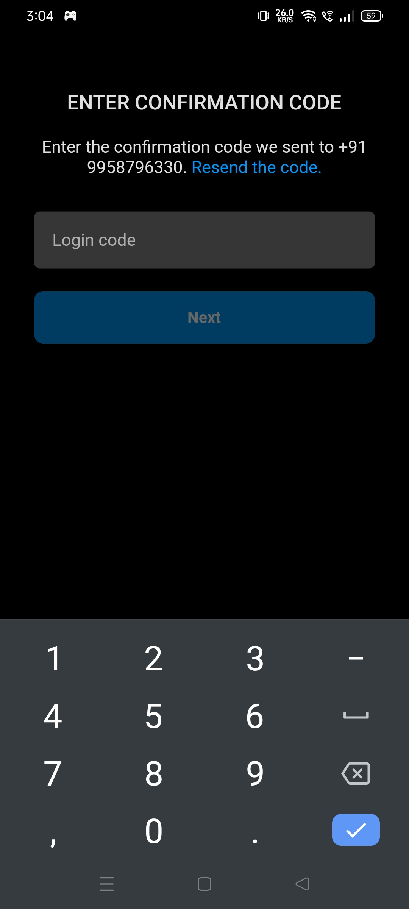

# Instagram Clone

This is a instagram clone developed with Flutter as front-end and Firebase as backend. It was developed as a personal project so it is not optimized. The app can handle sign up with either phone number or email, feeds page that displays new posts of all those people that are followed by the user, option to comment and like these posts all in real time.

It supports Android and Web app.

## Some Views





## How to Use

**Step 1:**

Download or clone this repo by using the link below:
```
https://github.com/BUSY-LOOPING/Instagram-Clone.git
```

**Step 2:**

Go to project root and execute the following command in console to get the required dependencies: 
```
flutter pub get 
```

**Step 3:**

Create a Firebase project, add the ```google-services.json``` file to ```android/app/src/``` directory. Also enable authentication with phone number and email id and save the details.

**Step 4:**

Add a file ```private_keys.dart``` to the ```lib/``` folder and define the following from the Firebase Server:
```
const String SERVER_KEY = '<YOUR-SERVER-KEY-HERE';
```
and
```
const FirebaseOptions FIREBASE_OPTIONS = FirebaseOptions(
  apiKey: '<YOUR-API-KEY-HERE>',
  appId: '<YOUR-APP-ID-HERE>',
  messagingSenderId: '<YOUR-MESSAGING-SENDER-ID-HERE>',
  projectId: '<YOUR-PROJECT-ID-HERE>',
  storageBucket: '<YOUR-STORAGE-BUCKET-HERE>',
);
```